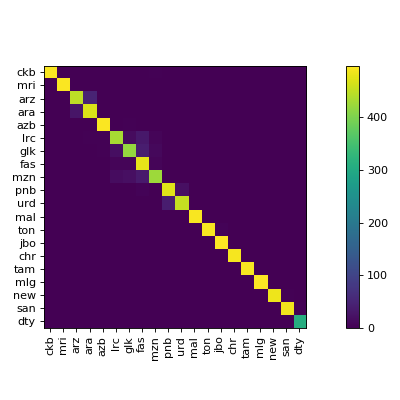

[](https://zenodo.org/badge/latestdoi/102892750)

# clana

`clana` is a toolkit for classifier analysis. It specifies some [file formats](file-formats.md)
and comes with some tools for typical tasks of classifier analysis.

## Installation

The recommended way to install clana is:

```
$ pip install clana --user
```

If you want the latest version:

```
$ git clone https://github.com/MartinThoma/clana.git; cd clana
$ pip install -e . --user
```

## Usage

```
clana --help
Usage: clana [OPTIONS] COMMAND [ARGS]...

Options:
  --version  Show the version and exit.
  --help     Show this message and exit.

Commands:
  get-cm         Calculate the confusion matrix (CSV inputs).
  get-cm-simple  Calculate the confusion matrix (one label per...
  visualize      Optimize confusion matrix.
```

The visualize command gives you images like this:




### Data distribution

```
$ clana distribution --gt gt.csv --labels labels.csv [--out out/] [--long]
```

prints one line per label, e.g.

```
60% cat (56789 elements)
20% dog (12345 elements)
 5% mouse (1337 elements)
 1% tux (314 elements)
```

If `--out` is specified, it creates a horizontal bar chart. The first bar is
the most common class, the second bar is the second most common class, ...

It uses the short labels, except `--long` is added to the command.


### Metrics

```
$ clana metrics --gt gt.csv --preds preds.csv
```

gives the following metrics by

* Line 1: Accuracy
* Line 2: Precision
* Line 3: Recall
* Line 4: F1-Score
* Line 5: Mean accuracy

### Visualizations

See [visualizations](visualizations.md)


## Development

Check tests with `tox`.
