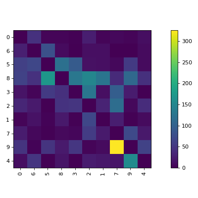
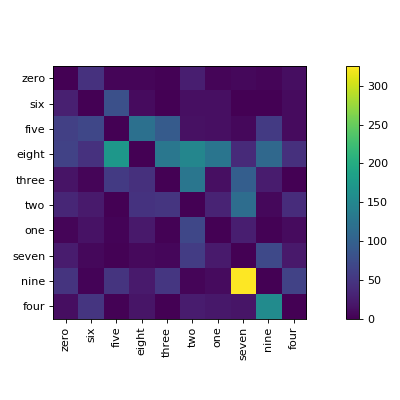

[](https://zenodo.org/badge/latestdoi/102892750)
[](https://badge.fury.io/py/clana)
[](https://pypi.org/project/clana/)
[](http://clana.readthedocs.io/en/latest/?badge=latest)
[](https://travis-ci.org/MartinThoma/clana)
[](https://coveralls.io/github/MartinThoma/clana?branch=master)

# clana

`clana` is a toolkit for classifier analysis. One key contribution of clana is
Confusion Matrix Ordering (CMO) as explained in chapter 5 of [Analysis and Optimization of Convolutional Neural Network Architectures](https://arxiv.org/abs/1707.09725). It is a technique
that can be applied to any multi-class classifier and helps to understand which
groups of classes are most similar.


## Installation

The recommended way to install clana is:

```
$ pip install clana --user
```

If you want the latest version:

```
$ git clone https://github.com/MartinThoma/clana.git; cd clana
$ pip install -e . --user
```

## Usage

```
clana --help
Usage: clana [OPTIONS] COMMAND [ARGS]...

Options:
  --version  Show the version and exit.
  --help     Show this message and exit.

Commands:
  distribution   Get the distribution of classes in a dataset.
  get-cm         Calculate the confusion matrix (CSV inputs).
  get-cm-simple  Calculate the confusion matrix (one label per...
  visualize      Optimize confusion matrix.
```

The visualize command gives you images like this:


### MNIST example

```
$ cd docs/
$ python mnist_example.py  # creates `train-pred.csv` and `test-pred.csv`
$ clana get-cm --gt gt-train.csv  --predictions train-pred.csv --n 10
2019-09-14 09:47:30,655 - root - INFO - cm was written to 'cm.json'
$ clana visualize --cm cm.json --zero_diagonal
Score: 13475
2019-09-14 09:49:41,593 - root - INFO - n=10
2019-09-14 09:49:41,593 - root - INFO - ## Starting Score: 13475.00
2019-09-14 09:49:41,594 - root - INFO - Current: 13060.00 (best: 13060.00, hot_prob_thresh=100.0000%, step=0, swap=False)
[...]
2019-09-14 09:49:41,606 - root - INFO - Current: 9339.00 (best: 9339.00, hot_prob_thresh=100.0000%, step=238, swap=False)
Score: 9339
Perm: [0, 6, 5, 8, 3, 2, 1, 7, 9, 4]
2019-09-14 09:49:41,639 - root - INFO - Classes: [0, 6, 5, 8, 3, 2, 1, 7, 9, 4]
Accuracy: 93.99%
2019-09-14 09:49:41,725 - root - INFO - Save figure at '/home/moose/confusion_matrix.tmp.pdf'
2019-09-14 09:49:41,876 - root - INFO - Found threshold for local connection: 398
2019-09-14 09:49:41,876 - root - INFO - Found 9 clusters
2019-09-14 09:49:41,877 - root - INFO - silhouette_score=-0.012313948323292875
    1: [0]
    1: [6]
    1: [5]
    1: [8]
    1: [3]
    1: [2]
    1: [1]
    2: [7, 9]
    1: [4]
```

This gives



#### Label Manipulation

Prepare a `labels.csv` which **has to have a header row**:

```
$ clana visualize --cm cm.json --zero_diagonal --labels mnist/labels.csv
```




### Data distribution

```
$ clana distribution --gt gt.csv --labels labels.csv [--out out/] [--long]
```

prints one line per label, e.g.

```
60% cat (56789 elements)
20% dog (12345 elements)
 5% mouse (1337 elements)
 1% tux (314 elements)
```

If `--out` is specified, it creates a horizontal bar chart. The first bar is
the most common class, the second bar is the second most common class, ...

It uses the short labels, except `--long` is added to the command.


### Metrics

```
$ clana metrics --gt gt.csv --preds preds.csv
```

gives the following metrics by

* Line 1: Accuracy
* Line 2: Precision
* Line 3: Recall
* Line 4: F1-Score
* Line 5: Mean accuracy

### Visualizations

See [visualizations](visualizations.md)


## Development

Check tests with `tox`.
